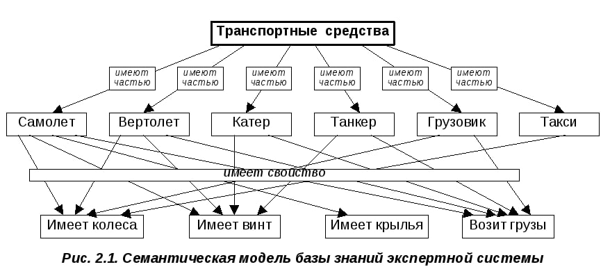
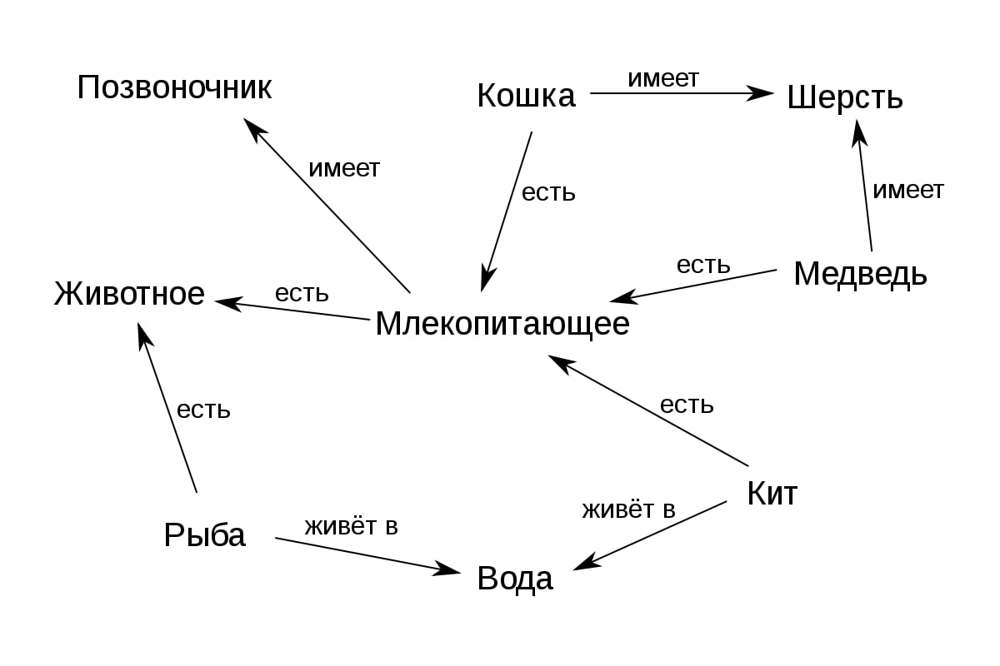

# ASTON-Course-Task2
Homework for the second lesson from the ASTON courses.

This is the second assignment in the ASTON course.
Task: To design a class hierarchy using interfaces and abstract classes.

    <table>
        <thead>
            <tr>
                <th>
                    
                </th>
                <th>
                    
                </th>
            </tr>
          </thead>
          <tbody>
              <tr>
                  <td align="center">
                      <h3>Picture 1</h3>
                  </td>
                  <td align="center">
                      <h3>Picture 2</h3>
                  </td>
              </tr>
        </tbody>
    </table>

